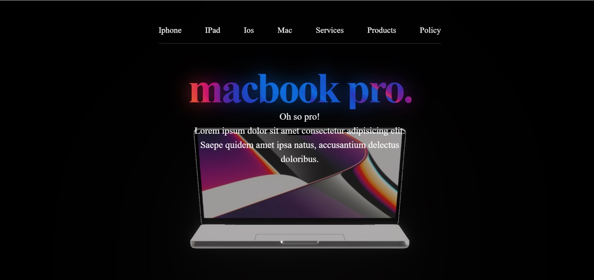

# Mac3D-Model

Mac3D-Model is a minimal React + Vite project template, designed for experimenting with 3D models or building new React features quickly. It comes with hot module replacement (HMR), ESLint, TailwindCSS, and 3D rendering support using Three.js and React Three Fiber.

---

## 🚀 Live Demo

<!-- Add your live link below -->
Live Project: [View Demo](https://macmodel.vercel.app/)

---

## 🖼️ Screenshots

<!-- Add your screenshot(s) here -->
<p align="center">
  
</p>

---

## 🛠️ Tech Stack

- **React** – UI library for building user interfaces
- **Vite** – Fast build tool and dev server
- **Three.js** – 3D graphics library
- **React Three Fiber** – React renderer for Three.js
- **@react-three/drei** – Useful helpers for React Three Fiber
- **TailwindCSS** – Utility-first CSS framework
- **ESLint** – Linting for code quality
- **PostCSS & Autoprefixer** – CSS processing

---

## Getting Started

1. Install dependencies:
	```
	npm install
	```
2. Start the development server:
	```
	npm run dev
	```
3. Open your browser at the provided local address.

---

## Customization

- Add your 3D model components or other React features in the `src` directory.
- Update ESLint rules as needed for your coding style.

---

## License

This project is open source. See the repository for license details.
